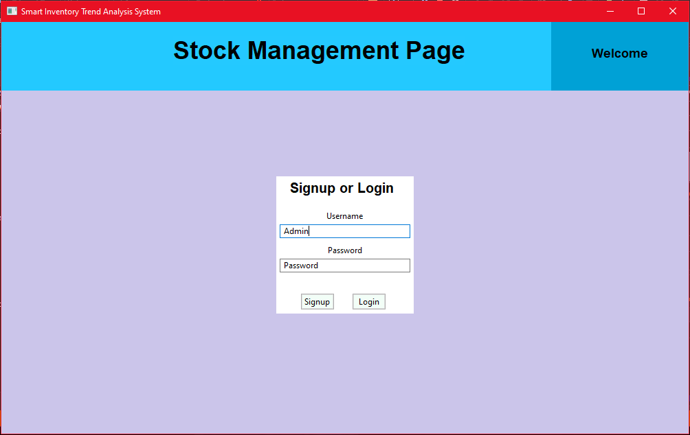
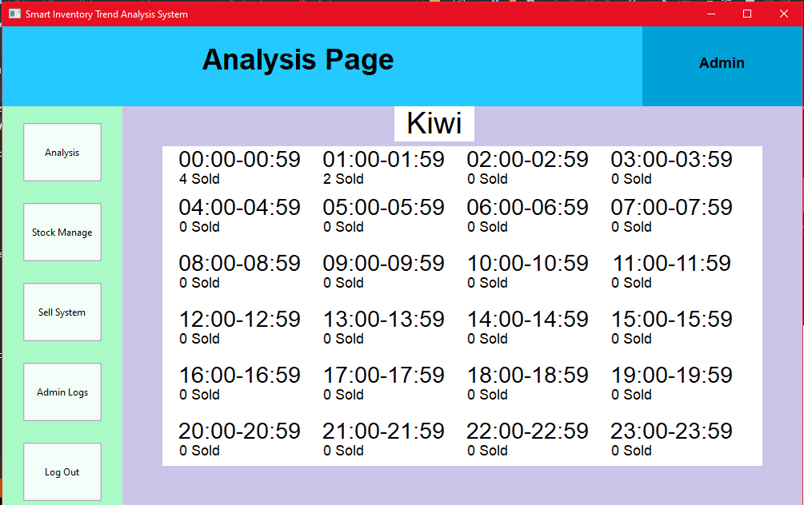

# Inventory-Trend-Analysis-System

## A fully functional Inventory Management System that shows Trend Insights based on Time and Weather written in C++

### :arrow_right: About
---------------------------------------------------------------------------------
This project makes use of a graphical user interface for a business such as a grocery shop to be able to manage their stock efficiently using the Stock Management Page. It also has a Sell System Page where as items are purchased, a person at a till for example can input the item sold and how much of it was sold and the system will automatically log the hour and weather at which it was sold. This information can then be viewed on the Analysis page to see if there are any trends in purchases of Ice Cream for example (It will probably show the highest number of products sold under the "Clear" weather) and the business can make use of these analytics accordingly. It also has an Admin Logs section where only the admin (The username "Admin" or "admin") can view what each staff member has sold and at what time and how much.
---------------------------------------------------------------------------------

### :desktop_computer: Quickstart
---------------------------------------------------------------------------------
This project makes use of a few libraries and was made using Visual Studio 2019 so preferably use a Visual Studio IDE when running and setting up this project. It was also made on a WindowsOS so please keep this in mind.

1. Clone this project
2. Install wxWidgets (https://www.wxwidgets.org/downloads/)
3. Build the libraries of wxWidgets in your IDE in x32 and x64 for both Debug and Release
4. Download and Install MySQL (You can download the community version from the Oracle website)
5. On a command line interface such as Command Prompt install vcpkg and then integrate it (so it works with Visual Studio or CMAKE)
6. Install Curl by running "vcpkg install curl" (I installed the x64 version)
7. Install JSON for Modern C++ using "vcpkg install nlohmann-json" (I installed the x64 version)
8. Make sure to properly include both wxWidgets and MySQL directories into your Include section in your IDE
9. The Unit Test folder contains Unit Tests that are for Microsoft C++ Unit Testing Framework and will only work with Visual Studio
10. In the Code you may have noticed that where there is a password there is "getenv", and the server details. You will need to use a server of your own and use your own password and details there instead of mine.
11. Also where there are calls to an API, please get your own API Key from OpenWeather and ipapi and paste it in to use with this project. (They are Completely Free as of Writing)
12. To setup the SQL Database for this go to the SQL Database Section below to see how the tables are setup.
13. If any of the following files are not found by your IDE "SciLexer.h", "Scintilla.h", or "stdafx.h" then you may download these online from a safe source and paste them into the main directory of the project.
---------------------------------------------------------------------------------

### :camera_flash: Screenshots
---------------------------------------------------------------------------------
#### Owner Unlock (When the software is launched, the Shop Owner/Manager must unlock it for the day using their SQL Password)

#### The Signup and Login Page (Where each Staff Member Signs Up and Logs In)

#### Stock Management Page (Where the stock can be manually changed around and new stock can be added/removed)

#### Sell System (Where the staff member at the till can input items sold and how much whenever they are sold)

#### Analysis System Find Item (The user inputs the item they want to analyze and if it is found it will proceed to the next part)

#### Analysis System Choose Time or Weather (The user chooses whether they want to analyze it based on Weather or Time)

#### Analysis System Weather (The user can view how much of the chosen item is sold based on the 7 weather types available on OpenWeather)

#### Analysis System Time (The user can view how much of the chosen item is sold based on the time)

#### Admin Logs (Only Accessible to the admin account and shows Logs) (I reset the table before taking this screenshot)

---------------------------------------------------------------------------------
